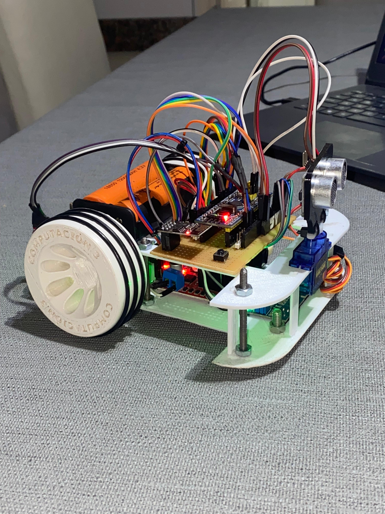

# 🚗 Smart Autonomous Car

  

Sistema embebido desarrollado en C/C++ sobre plataforma mbed para un vehículo autónomo con múltiples modos de operación, sensores y comunicación serial/WiFi.

---

## 📸 Vista del sistema

  

## 🧠 Descripción

Este proyecto consiste en el desarrollo de un vehículo autónomo capaz de:

- Seguir líneas
- Evitar obstáculos
- Mantener distancia con objetos
- Explorar caminos y elegir rutas

El sistema implementa múltiples modos de operación controlados por una máquina de estados y utiliza diversos sensores para la percepción del entorno.

El código base está documentado en :contentReference[oaicite:0]{index=0}.

---

## ⚙️ Tecnologías utilizadas

- Lenguaje: C / C++
- Framework: mbed
- Comunicación:
  - USART (serial)
  - WiFi (ESP)
- Control por interrupciones
- Arquitectura basada en tareas

---

## 🔌 Hardware utilizado

- Microcontrolador (mbed compatible)
- Motores DC con control PWM
- Servo motor
- Sensor ultrasónico (HC-SR04)
- Sensores infrarrojos (IR x3)
- Sensores de velocidad (horquillas)
- Módulo WiFi (ESP)
- Botones y LEDs

---

## 🚀 Funcionalidades principales

### 📡 Comunicación
- Protocolo propio basado en frames `UNER`
- Comunicación por:
  - Serial (USB)
  - WiFi (UDP)

### 🎛️ Control del sistema
- Recepción de comandos remotos
- Control de motores y servo
- Lectura de sensores en tiempo real

### 📊 Sensores
- Distancia (ultrasonido)
- Línea (IR: izquierda, centro, derecha)
- Velocidad (encoders por interrupción)

---

## 🤖 Modos de operación

### 🔹 Modo 0 – IDLE
- Sistema detenido
- LED de heartbeat activo

---

### 🔹 Modo 1 – Seguidor de línea
- Sigue línea negra con 3 sensores IR
- Corrección dinámica de trayectoria
- Evita obstáculos (comentado en código pero preparado)

---

### 🔹 Modo 3 – Seguimiento de objeto
- Escaneo con servo (tipo radar)
- Detección de objeto más cercano
- Movimiento automático manteniendo distancia (control tipo P)

---

### 🔹 Modo 4 – Búsqueda de camino óptimo
- Navegación compleja basada en estados
- Detección de caminos y bifurcaciones
- Lectura de “códigos” mediante líneas negras
- Selección de ruta más corta

---

## 🧩 Arquitectura del sistema

El sistema está dividido en tareas:

- `serialTask()` → comunicación
- `distanceTask()` → medición ultrasónica
- `irSensorsTask()` → lectura IR
- `speedTask()` → cálculo de velocidad
- `servoTask()` → control del servo
- `followLine()` → lógica de seguimiento
- `PID()` → control de distancia
- `turn()` → giros controlados

---

## 🧠 Algoritmos implementados

- Máquina de estados compleja
- Control proporcional (P) para distancia
- Seguimiento de línea basado en sensores IR
- Navegación reactiva con evasión
- Escaneo angular con servo (radar)

---

## 📡 Protocolo de comunicación

Formato de trama:
